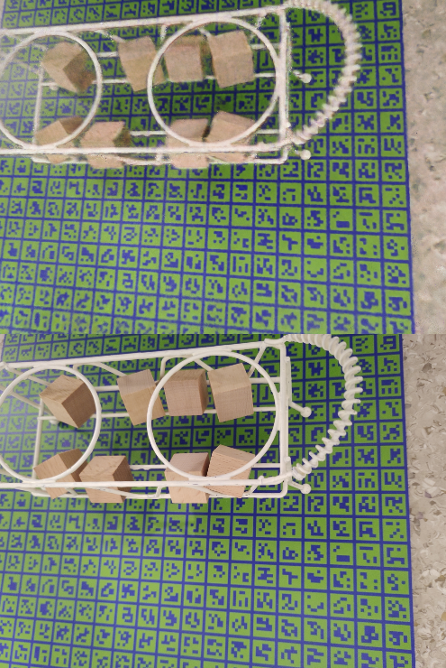
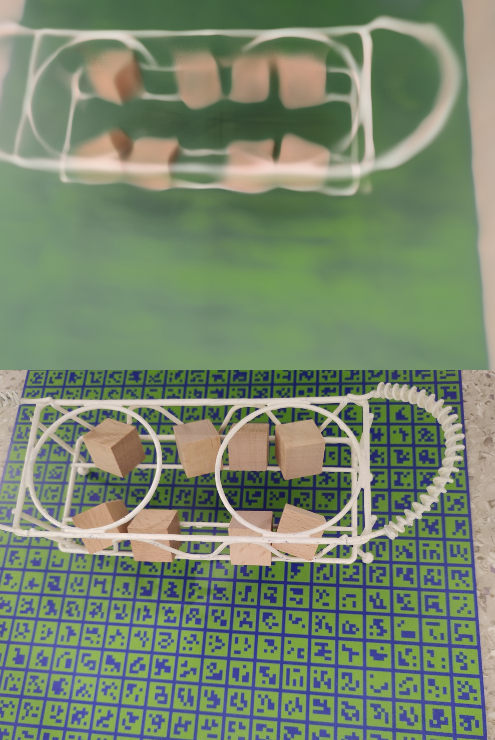

# Multires Hash Encoding with NeuS

This is an experiment replacing the nerf-like models from NeuS with drop in multires hash encoding models inspired by NVIDIA [InstantNGP](https://nvlabs.github.io/instant-ngp/). The multires hash encoding models are located in [models/hash_fields.py](models/hash_fields.py).

|  | |
|:---:|:---:|
| *Hash encoding after 5K steps (top). Ground truth (bottom)* | *Original NeuS after 5K steps (top). Ground truth (bottom)* |  

Also see:
- [Multires Hash Encoding Pytorch](https://github.com/jenkspt/multires-hash-encoding-pytorch.git)  
<br>

(Original README ...)  
# Neus
We present a novel neural surface reconstruction method, called NeuS (pronunciation: /nuːz/, same as "news"), for reconstructing objects and scenes with high fidelity from 2D image inputs.


## [Project page](https://lingjie0206.github.io/papers/NeuS/) |  [Paper](https://arxiv.org/abs/2106.10689) | [Data](https://drive.google.com/drive/folders/1Nlzejs4mfPuJYORLbDEUDWlc9IZIbU0C?usp=sharing)
This is the official repo for the implementation of **NeuS: Learning Neural Implicit Surfaces by Volume Rendering for Multi-view Reconstruction**.

## Usage

#### Data Convention
The data is organized as follows:

```
<case_name>
|-- cameras_xxx.npz    # camera parameters
|-- image
    |-- 000.png        # target image for each view
    |-- 001.png
    ...
|-- mask
    |-- 000.png        # target mask each view (For unmasked setting, set all pixels as 255)
    |-- 001.png
    ...
```

Here the `cameras_xxx.npz` follows the data format in [IDR](https://github.com/lioryariv/idr/blob/main/DATA_CONVENTION.md), where `world_mat_xx` denotes the world to image projection matrix, and `scale_mat_xx` denotes the normalization matrix.

### Setup

Clone this repository

```shell
git clone https://github.com/Totoro97/NeuS.git
cd NeuS
pip install -r requirements.txt
```

<details>
  <summary> Dependencies (click to expand) </summary>

  - torch==1.8.0
  - opencv_python==4.5.2.52
  - trimesh==3.9.8 
  - numpy==1.19.2
  - pyhocon==0.3.57
  - icecream==2.1.0
  - tqdm==4.50.2
  - scipy==1.7.0
  - PyMCubes==0.1.2

</details>

### Running

- **Training without mask**

```shell
python exp_runner.py --mode train --conf ./confs/womask.conf --case <case_name>
```

- **Training with mask**

```shell
python exp_runner.py --mode train --conf ./confs/wmask.conf --case <case_name>
```

- **Extract surface from trained model** 

```shell
python exp_runner.py --mode validate_mesh --conf <config_file> --case <case_name> --is_continue # use latest checkpoint
```

The corresponding mesh can be found in `exp/<case_name>/<exp_name>/meshes/<iter_steps>.ply`.

- **View interpolation**

```shell
python exp_runner.py --mode interpolate_<img_idx_0>_<img_idx_1> --conf <config_file> --case <case_name> --is_continue # use latest checkpoint
```

The corresponding image set of view interpolation can be found in `exp/<case_name>/<exp_name>/render/`.

### Train NeuS with your custom data

More information can be found in [preprocess_custom_data](https://github.com/Totoro97/NeuS/tree/main/preprocess_custom_data).

## Citation

Cite as below if you find this repository is helpful to your project:

```
@article{wang2021neus,
  title={NeuS: Learning Neural Implicit Surfaces by Volume Rendering for Multi-view Reconstruction},
  author={Wang, Peng and Liu, Lingjie and Liu, Yuan and Theobalt, Christian and Komura, Taku and Wang, Wenping},
  journal={arXiv preprint arXiv:2106.10689},
  year={2021}
}
```

## Acknowledgement

Some code snippets are borrowed from [IDR](https://github.com/lioryariv/idr) and [NeRF-pytorch](https://github.com/yenchenlin/nerf-pytorch). Thanks for these great projects.
